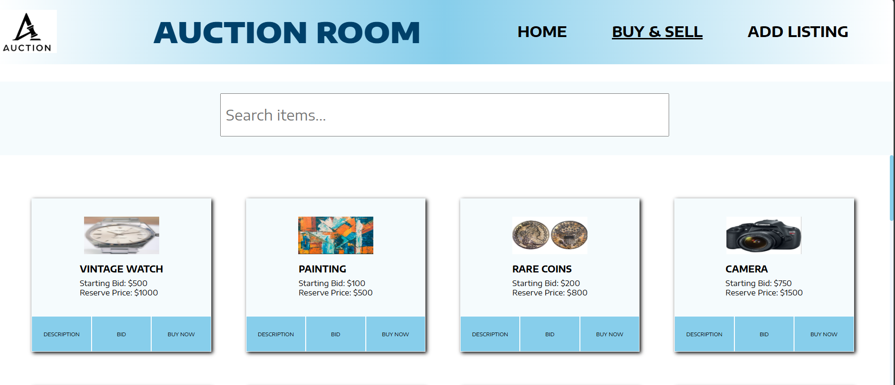
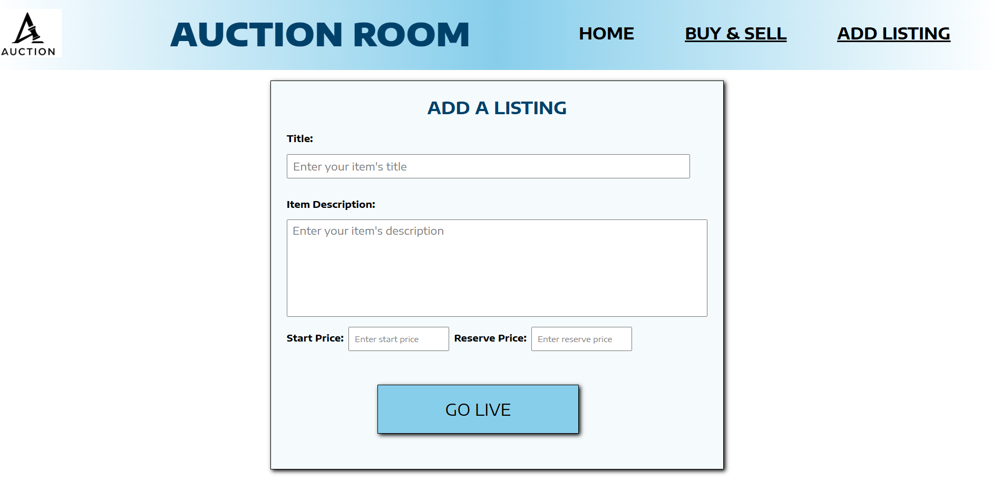

# auction-app
This project is a full-stack auction listing application built using the MERN stack. It features a custom command-line interface (CLI) tool for managing listings directly from the terminal. This was my first time building a CLI tool, and it showcases my ability to integrate backend logic with interactive command-line functionality.

# Homepage
Routes to buy & sell page and listings

# Buy & Sell page
Dynamic search bar
Dynamic auction listing cards.

# Add Listing Page
Create a new listing to the database.

